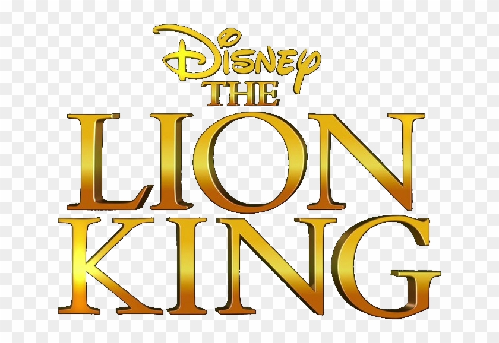

Recriando o jogo da Memória

 <a href="#computer-sobre">• Sobre</a> | 
 <a href="#memo-roteiro">• Roteiro</a> | 
 <a href="#hammer-tecnologias">• Tecnologias</a> | 
 <a href="#boy-autor">• Autor</a> 

## :computer: **Sobre**

Desafio pratico de recreação do Jogo da Memória. 

## :memo: **Roteiro**

Nesse projeto, o desafio foi criar um jogo da memória utilizando apenas HTML, CSS e Javascript. Com poucas linhas de código.

 

## :hammer: **Tecnologias**

 HTML
 JavaScript
 CSS, com efeitos 3D. 
 Lógica de programação utilizando condicionais, Immediately Invoked Function Expression e manipulação de Array.

## :girl: **Autora**

Feito por Alane G. Brito ❤️

